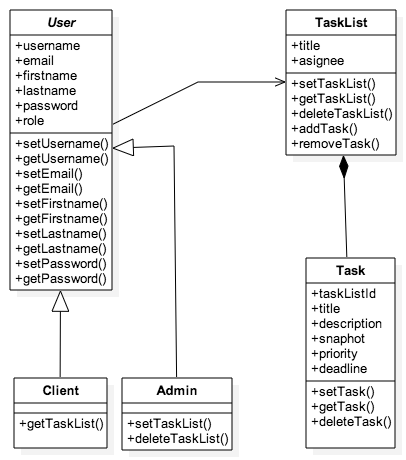

# tasks-app

Repository for a Meteor task management app http://tasks-app.meteor.com/

Android .apk can be found in`/public/tasks-app_0.0.1.apk`, or: [click for download](https://github.com/loredanacirstea/tasks-app/raw/master/public/tasks-app_0.0.1.apk)

### Some of the known bugs/caveats:
* Fully reactive grid - after inserting/updating a new task, some values are not retrieved correctly due to using joined collections. If page is refreshed, the output is correct.
* Does not display error on insert/update with same username as someone else
* Remove empty columns from the update & remove buttons, when user is not admin
* When uploading an image with a complex name (such as a default ScreenShot title), it will not be retrieved in the grid correctly

### Class Diagram

### Packages used:

    meteor add accounts-password
    meteor add ian:accounts-ui-bootstrap-3
    meteor add alanning:roles
    meteor add aldeed:simple-schema
    meteor add aldeed:collection2
    meteor add aldeed:autoform
    meteor add yogiben:autoform-modals
    meteor add yogiben:autoform-file
    meteor add cfs:standard-packages
    meteor add cfs:filesystem
    meteor add aldeed:tabular
    meteor add mrt:moment
    meteor add cottz:publish-with-relations
    meteor add twbs:bootstrap
    meteor add iron:router
